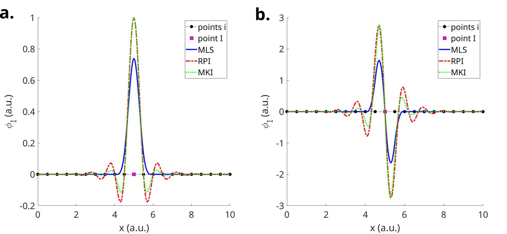

# Summary

Meshfree Methods (MMs) are considered an attractive alternative to mesh-based methods 
such as the Finite Element Method (FEM) due to their efficiency in solving 
complex problems (e.g. large deformation, fracture). However, MMs have 
not yet reached the maturity of FEM and they are a topic of active research.
While there is a vast literature in MMs, commercial or open source packages
based on MMs are still limited and implementing them from scratch may be challenging.

Here we present `MFREE`, a MATLAB toolkit providing an implementation of several  meshfree approximation schemes for 1D, 2D and 3D problems. 
We chose MATLAB because its user-friendly syntax facilitates understanding of the implementation procedure, which makes it popular in the engineering community.
`MFREE` implements the Moving Least Squares (MLS), the Radial Point Interpolation (RPI) and the Moving Kriging Interpolation (MKI) meshfree approximation schemes, 
which are widely used in MMs such as the Element-free Galerkin [@belytschko:1995] and Meshless Local Petrov Galerkin [@atluri:1998] methods.

# Statement of need 

`MFREE` is designed to be used by both engineering researchers and students in courses on computational mechanics and other topics where MMs can be of interest. 
It has already been used in a number of scientific publications [@mountris:2019; @mountris:2020]. This toolkit  aims to provide a basis for the design and 
implementation of meshfree packages that serves to support the integration of MMs in the engineer's artillery to solve challenging problems.

# Theoretical aspects

For any real-valued function $u(\textbf{x})$ defined in a domain $\Omega \subset \mathbb{R}^d$, a meshfree approximation $u^h(\textbf{x})$ at a point $I \in \Omega$ is obtained by:

\begin{equation}
    u^h(\textbf{x}_I) = \sum_{i=1}^m \phi_I^i u(\textbf{x}_i)
\end{equation}

where $\textbf{x}_I$ and $\textbf{x}_i$ are the coordinates vectors of the point $I$ and the $i^{th}$ point ($i=1,2,\dots,m$) in the support domain of point $I$ (being I one of these points). $\phi_I^i$ is the value of the meshfree approximation function $\textbf{\phi}_I$ at point $i$. In the following, we briefly describe the construction of $\textbf{\phi}_I$ in the Moving Least Squares, Radial Point Interpolation and Moving Kriging Interpolation schemes. The vector $\textbf{\phi}_I$ contains the values of the meshfree approximation function at all points $i$ in the support domain of point $I$.

## Moving Least Squares

In the Moving Least Squares (MLS) scheme [@lancaster:1981], the meshfree approximation function $\textbf{\phi}_I$ for point $I$ is given by:

\begin{equation}
    \textbf{\phi}_I = \textbf{p}_I \textbf{A}^{-1} \textbf{B},
\end{equation}

where the polynomial basis $\textbf{p}_I$ for point $I$ and matrices $\textbf{A}$ and $\textbf{B}$ are defined as follows. 

For any point $i$ in the support domain of point $I$ with coordinates $\textbf{x}_i = \left( x_i, y_i \right)$ in 2D (analogously for 1D and 3D), the complete polynomial basis $\textbf{p}_i$ is given by:

\begin{equation} \label{eq:poly_basis}
   \textbf{p}_i = \left[ 1 \; x_i \; y_i \; x_i^2 \; x_i y_i \; y_i^2 \hdots \; x_i^k \; y_i^k \right].
\end{equation}

where $k$ is the maximal order of the monomials in $\textbf{p}_i$. Let's denote the number of monomials in $\textbf{p}_i$ by $n$, which depends on $k$ and on the spatial dimension (1D, 2D or 3D). For the linear polynomial basis, i.e. $k=1$, $\textbf{p}_i$ is defined as:

\begin{equation}
\begin{array}{ll}
    \textbf{p}_i = [1 \; x_i], &(n=2) \textrm{ in 1D}, \\
    \textbf{p}_i = [1 \; x_i \; y_i], &(n=3) \textrm{ in 2D}, \\
    \textbf{p}_i = [1 \; x_i \; y_i \; z_i], &(n=4) \textrm{ in 3D}. \\
\end{array}
\end{equation}

The matrices $\textbf{A}$ and $\textbf{B}$ are given by:
\begin{equation}
\begin{array}{ll}
    \textbf{A} &= \textbf{P}^T\textbf{W}\textbf{P}, \\
    \textbf{B} &= \textbf{P}^T\textbf{W},
\end{array}
\end{equation}

where $\textbf{P}$ is the polynomial basis moment matrix:
\begin{equation} \label{eq:poly_moment}
    \textbf{P} = \left[
             \begin{matrix}
                1 & x_1 & y_1 & \hdots & p_k(\textbf{x}_1)\\
                1 & x_2 & y_2 & \hdots & p_k(\textbf{x}_2)\\
                \hdots & \hdots & \hdots & \hdots & \hdots\\
                1 & x_m & y_m & \hdots & p_k(\textbf{x}_m)\\
                \end{matrix}
                \right]_{(m \cross n)},
\end{equation}

$\textbf{W}$ is the weight function moment matrix:
\begin{equation}
    \textbf{W} = \left[
             \begin{matrix}
                w_{11} & w_{12} & \hdots & w_{1m}\\
                w_{21} & w_{22} & \hdots & w_{2m}\\
                \hdots & \hdots & \hdots & \hdots\\
                w_{m1} & w_{m2} & \hdots & w_{mm}\\
                \end{matrix}
                \right]_{(m \cross m)}.
\end{equation}

## Radial Point Interpolation 

In the Radial Point Interpolation (RPI) scheme [@liu:2002], the meshfree approximation function $\textbf{\phi}_I$ for point $I$ is given by:

\begin{equation}
    \textbf{\phi}_I = \{ \textbf{r}_I \; \; \textbf{p}_I\} \textbf{G}^{-1},
\end{equation}

where $\textbf{p}_I$ is the polynomial basis as defined from equation (\ref{eq:poly_basis}). For any point $i$ in the support domain of point $I$, $\textbf{r}_i$ denotes the radial basis function vector given by:

\begin{equation}
    \textbf{r}_i = \left[ r_{i1} \; r_{i2} \; \dotso \; r_{im} \right],
\end{equation}

where $r_{ij}$, $i,j= 1,2,\dots,m$, is the value of the radial basis function $r_i$ for point $i$ evaluated at point $j$, i.e. $r_{ij} = r_i(\textbf{x}_j)$. For common choices of radial basis functions, see [@liu:2002].

The matrix $\textbf{G}$ is given by:
\begin{equation}
    \textbf{G} = \left[
             \begin{matrix}
                \textbf{R}   & \textbf{P}\\
                \textbf{P}^T & \textbf{0}
                \end{matrix}
                \right]_{(m+n \cross m+n)},
\end{equation}

where $\textbf{P}$ is the polynomial basis moment matrix defined as in equation (\ref{eq:poly_moment}) and $\textbf{R}$ is the radial basis function moment matrix:
\begin{equation}
    \textbf{R} = \left[
             \begin{matrix}
                r_{11} & r_{12} & \hdots & r_{1m}\\
                r_{21} & r_{22} & \hdots & r_{2m}\\
                \hdots & \hdots & \hdots & \hdots\\
                r_{m1} & r_{m2} & \hdots & r_{mm}\\
                \end{matrix}
                \right]_{(m \cross m)}.
\end{equation}

## Moving Kriging Interpolation

In the Moving Kriging Interpolation (MKI) scheme [@gu:2003], the meshfree approximation function $\textbf{\phi}$ at point $I$ is given by:

\begin{equation}
    \textbf{\phi}_I = \textbf{p}_I\textbf{A} + \textbf{c}_I\textbf{B} 
\end{equation}

where $\textbf{p}_I$ is the polynomial basis as defined from equation (\ref{eq:poly_basis}). For any point $i$ in the support domain of point $I$, $\textbf{c}_I$ denotes the correlation function vector given by:

\begin{equation}
    \textbf{c}_i = \left[ c_{i1} \; c_{i2} \; \dotso \; c_{im} \right]
\end{equation}

where $c_{ij}$, $i,j=1,2,\dots,m$, is the value of the correlation function $c_i$ for point $i$ evaluated at point $j$, i.e. $c_{ij} = c_i(\textbf{x}_j)$. For common choices of correlation functions, see [@gu:2003].

The matrices $\textbf{A}$ and $\textbf{B}$ are obtained by:

\begin{align}
\begin{split}
    \textbf{A} &= (\textbf{P}^T\textbf{C}^{-1}\textbf{P})^{-1} \textbf{P}^T \textbf{C}^{-1} \\
    \textbf{B} &= \textbf{C}^{-1}(\textbf{I} - \textbf{P}\textbf{A})
\end{split}
\end{align}

where $\textbf{I}$ is the identity matrix, $\textbf{P}$ is the polynomial basis moment matrix defined as in equation (\ref{eq:poly_moment}) and $\textbf{C}$ is the correlation function moment matrix:

\begin{equation}
    \textbf{C} = \left[
             \begin{matrix}
                c_{11} & c_{12} & \hdots & c_{1m}\\
                c_{21} & c_{22} & \hdots & c_{2m}\\
                \hdots & \hdots & \hdots & \hdots\\
                c_{m1} & c_{m2} & \hdots & c_{mm}\\
                \end{matrix}
                \right]_{(m \cross m)}.
\end{equation}

# Program structure

In this section we describe the `MFREE` toolkit's program structure. `MFREE` is freely available at [https://www.mountris.org/softwares/mlab/MFREE](https://www.mountris.org/softwares/mlab/MFREE) and on GitHub [https://github.com/KMountris/MFREE](https://github.com/KMountris/MFREE). It is released under the MIT license and its current stable release is version 1.0.0.

## aux

The subfolder *aux* contains auxiliary functions. The function *LineMesh.m* constructs a regular mesh of line elements in 1D. *QuadMesh.m* constructs a regular quadrilateral mesh in 2D and *HexMesh.m* constructs a regular hexahedral mesh in 3D. The functions *TriMesh.m* and *TetMesh.m* construct an irregular mesh of simplicial elements in 2D and 3D, respectively. The functions *ShowSolution2D.m* and *ShowSolution3D.m* are used to visualize the solution of a scalar field in either 2 or 3 dimensions.

## mfree-1.0.0

The subfolder *mfree-1.0.0* contains the implementaion of the meshfree approximation functions. *MlsShape.m*, *RpiShape.m*, and *MkiShape.m* are used to compute the MLS, RPI and MKI meshfree approximation functions, respectively. Both the approximation function and its first gradient are computed. The interface function *MfreeShape.m* can be used to compute either the MLS, RPI or MKI approximation, depending on the selected scheme. *MfreeOptions.m* generates a structure containing the default values of the parameters for each meshfree approximation. The default options should be adjusted by the user before use to ensure accurate results. Finally, the functions *ComputeEnrichedRadialBasis* and *ComputeCorrelationBasis.m* are used to compute the corresponding basis functions that are used for the construction of the RPI and MKI approximations, respectively.

## paper

The subfolder *paper* contains source files for the generation of the accompanying article **MFREE: A matlab toolkit for meshfree approximation schemes**.

## support

The subfolder *support* contains the function *SupportRadius.m* which is used to calculate the radius of the support domain for each node of the domain and *SupportNeighs.m* which is used to find the neighbor points $i$ in the local support domain of point $I$.

## textprogressbar

The subfolder *textprogressbar* contains the program **Paul (2020). Text progress bar** [https://www.mathworks.com/matlabcentral/fileexchange/28067-text-progress-bar](https://www.mathworks.com/matlabcentral/fileexchange/28067-text-progress-bar)**, MATLAB Central File Exchange** for progress reporting during execution.

## weights

The subfolder *weights* contains the implementation of various weight functions, radial basis functions and correlation functions that are used for the computation of $\textbf{W}$, $\textbf{R}$ and $\textbf{C}$ matrices in the MLS, RPI and MKI schemes, respectively. The available functions are: cubic spline (*CubicSpline.m*), quartic spline (*QuarticSpline.m*), Gaussian function (*Gaussian.m*), multiquadric radial basis function (*Multiquadric.m*), compact-support radial basis function (*CompactRBF.m*), thin plate spline (*ThinPlateSpline.m*).

# Examples

The programs *test_1D.m*, *test_2D.m*, *test_3D.m* provide examples of how to use the `MFREE` toolkit for 1D, 2D and 3D problems, respectively. In these programs, the basis functions and the first derivatives of the meshfree function approximations (MLS, RPI, MKI) are compared. An illustration for the 1D case is given in Figure \autoref{fig:mfree_comp}. In this example, the MLS approximation is computed using the quartic spline as weight function. The multiquadric radial basis function and the Gaussian function are used as radial basis function and correlation function, respectively, for the computation of the RPI and MKI approximations. All the approximations are computed using the linear polynomial basis ($k=1$).

# Acknowledgements

This work was supported by the European Research Council under grant agreement ERC-StG 638284, by Ministerio de Ciencia e Innovación (Spain) through project PID2019-105674RB-I00 and by European Social Fund (EU) and Aragon Government through BSICoS group (T39_20R) and project LMP124-18. Computations were performed by the ICTS NANBIOSIS (HPC Unit at University of Zaragoza).

# References 
